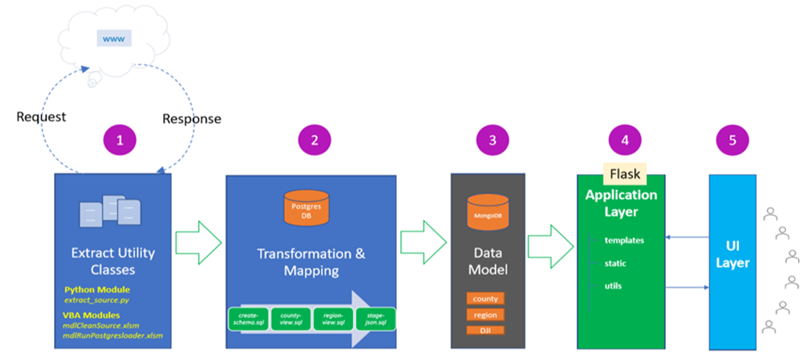

# NYCares
### A deep dive analysis into the impact COVID-19 has had on different counties within New York.

**Team:** Karl Ramsay (Project Manager - Back-End), Swati Dontamsetti (Front-End), Firzana Razak (Front-End), Amber Martin (Back-End), Oswaldo Moreno (Back-End), Anthony Brown (Back-End)

## Overview
With a potential plateau in COVID-19 cases in NY, but no definite decrease as of yet, we are interested into seeing what the impact has been on the different counties of NY. We look into the demographic and socio-economic breakdown of each county, while keeping in mind how the impact has varied from county to county.

*Hypothesis: Harder hit counties are poorer and more racially diverse.*

We also wanted to see what the correlation is between Wall St and Main St. We know that the stock market crashed pretty severely but is picking back up again, which is disconnected from the way every day people are dealing with COVID-19 since cases have yet to decrease.

*Hypothesis: The stimulus has a stabilizing effect on the market, even though cases are still rising.*

We use Census data from the <a href="https://www.labor.ny.gov/stats/nys/statewide-population-data.shtm">NY Dept of Labor</a>, the Dow Jones Index from <a href="https://finance.yahoo.com/quote/%5EDJI/history?p=%5EDJI">Yahoo Finance</a>, COVID cases and deaths from <a href="https://usafacts.org/visualizations/coronavirus-covid-19-spread-map/">USA Facts</a>, Free and Reduced-price Lunch data from <a href="https://www.nyskwic.org/get_data/indicator_data.cfm">NY State KWIC</a>, NY County Median Income by Race from the <a href="https://www.census.gov/topics/income-poverty/income/data/tables.html">Census Bureau</a>,and the GeoJSON for NY Counties from <a href="https://github.com/johan/world.geo.json/tree/master/countries/USA/NY">Github</a>.

### Instructions
1. Open app/module folder in terminal or Git Bash.
2. Run **python load_mongo_db.py**. 
3. Open app folder.
4. Run **python app.py**. 
5. Open browser window and type http://127.0.0.1:5000/

### Some Considerations
All of the data was collected on May 22nd, and was analyzed for that date.

## The analysis was done using the ETL model.

## Extract
We used `Beautiful Soup` in `Jupyter Notebook` to scrape data from Indeed. We scraped indeed 5 different times for each of our 5 "Top Cities:" New York, Chicago, Boston, San Francisco (Bay Area), and Seattle. The data we were looking for was the job title, company, location, salary, and date posted from each job posting.

However, because Indeed provides results based on a radius, it gave us results from other cities and neighboring states as well. All the data collected was gathered into one dataframe, which was saved as a CSV.

Our second data source was from the IHME's website. The data was already provided to us as CSV.

## Transform
### Indeed Data
The Indeed Data was cleaned in `Jupyter Notebook` using `Python` and the `pandas` library. The process was many fold.
1. We had to take out "\n" and replace it was a space every where it appeared.
2. The day posted column came as a phrase like "18 days ago", but we only wanted the number. So we split the column into many columns using the space. And afterwards, we had to split it by "+" to take it out of the "30+ days ago." And then all the columns, except the one with number, were dropped.  
  2a. We were then left with the phrase "Today" and "Just", which was part of "Just Now", which had to be replaced with the number 0.  
  2b. The posted date had to be made negative for when we created our graphs, since the day posted was the number of days AGO from the day the data was gathered. 
3. We then dropped all results where there was no job title present.
4. As a CSV, the datetime was made into an object, so we had to transform it back into a datetime so that it could used later for math that was done in the COVID-19 Data.

### COVID-19 Data
The data from IHME was comprehensive, and provided results from numerous states and many different countries. It also provided more hospital data (like number of ventilators needed and ICU beds used) than we need. The data was first cleaned manually in `Excel` and then in `Jupyter Notebook`.
1. All rows that were the new deaths, new COVID-19 cases, and total deaths were deleted.
2. All columns that weren't the states of our Top Cities, and over all Country results (USA, New York, Illinois, Massachusetts, California, and Washington) were deleted.
* This was then saved as a CSV to be read in `Jupyter Notebook`
3. The data column needed to be transformed into datetime, so that, the date in the COVID-19 Data could be subtracted for the date the data was gathered in the Indeed Data to create a column that showed how many days ago the results were taken.  
3a. This new column was added to the original COVID-19 data.
4. The data was first seperated into 6 new data frames - one for each state/country - so that data could be plotted over time using the `matplotlib.pyplot` and `numpy` libraries.

## Load

We used the micro-framework `Flask` inside of `Python` to create our website that would showcase our data. Both `HTML` and the `Bootstrap` library were used to beautify our website.

The final data was stored in a `Mongo` database, which was used to print our Indeed results. We chose to limit the number of results chosen to 300, because the 18,000 results we had saved would take too long to load on our page.

## Final Results & Analysis
*Consideration: Even though we placed job postings and COVID-19 cases on top of each other we should consider prior COVID-19 spikes and dips as affecting future job postings. So, the dip in COVID-19 cases 19 days ago in CA might account for the spike in job postings 17 days ago, and the subsequent spike in COVID-19 cases 17 days ago might account for the dip in job postings 13 days ago.*

In general, our hypothesis is correct: as new cases of COVID-19 cropped up, the number of job postings have declined. The degree to which this is true varies from State to State, as seen below.
